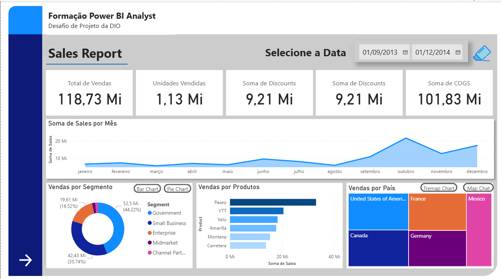
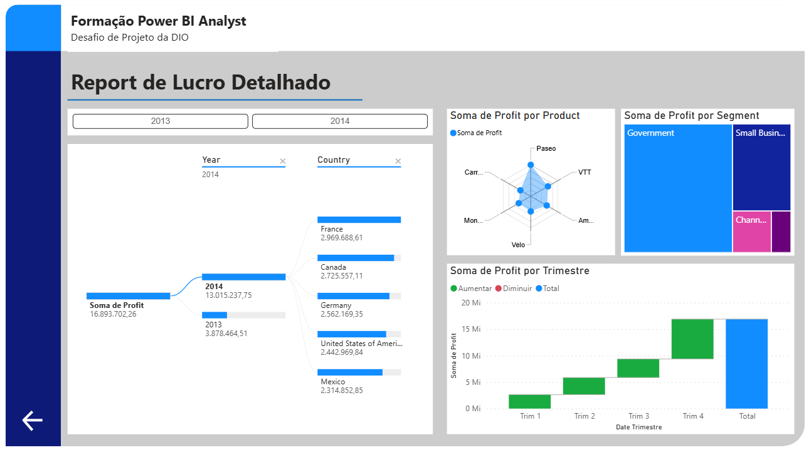

# Relatório Financeiro com Power BI

Projeto desenvolvido como parte do desafio de Power BI da DIO.

O objetivo foi criar um relatório financeiro interativo utilizando a base
Financial Sample, aplicando recursos de visualização de dados, segmentação,
navegação entre páginas e análise de indicadores.

## 📊 Visão geral do projeto

O relatório apresenta análises relacionadas a:

- Vendas;
- Lucro;
- Unidades vendidas;
- Produtos;
- Segmentos;
- Países;
- Períodos;
- Faixas de desconto.

## 🛠️ Ferramentas utilizadas

- Microsoft Power BI Desktop;
- Microsoft Power BI Service;
- Microsoft Excel;
- GitHub.

## 📈 Funcionalidades

- Navegação entre as páginas do relatório;
- Segmentadores para filtragem dos dados;
- Indicadores financeiros;
- Gráficos interativos;
- Botões para alternar entre diferentes visualizações;
- Análise detalhada dos resultados financeiros.

## 🖼️ Páginas do relatório

### Página 1 — Visão geral

### Página 2 — Análise detalhada

## 📁 Arquivo do Power BI

O arquivo completo está disponível neste repositório:

[Baixar relatório em Power BI](relatorio-financials.pbix)

## 👨‍💻 Autor

Desenvolvido por Italo Costa.
